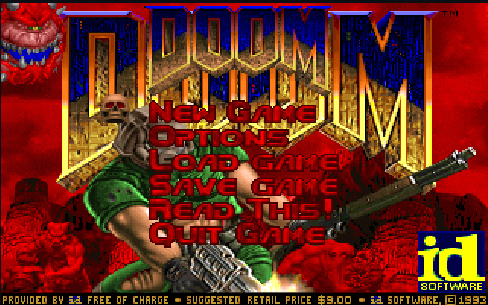

# DOOM

I don't think DOOM itself needs much introduction. This version of DOOM is a fork of the original [Doom: linuxdoom-1.10 open source release](https://github.com/id-Software/DOOM) released to the public by ID-Software. 

The original code was written to be portable, so, I have ported this to work with raylib. The original code uses deprecated X11 functions, but I have replaced them here with raylib for video, and keyboard inputs functionality.

Moreover, I have also hacked the code a bit, such that, it can compile as a 64 bit application (the original source code was written mostly for 32 bit machines).

# Compilation
## Requirements
1. Like the original code, this compiles only in linux, I am not sure how much tweaking is needed to be compiled as a windows application. So, linux is a must.
2. Make sure you have [raylib](https://www.raylib.com/) installed. The default Makefile scripts assume you have raylib globally available but you can add your include paths there. 
3. `gcc` or any C compiler, I have tested this with gcc only.
4. You will also need `doom1.wad` file, or any .wad file renamed to `doom1.wad`. This file is something that wasn't opensourced but you will find free/fan-made versions all over the internet, make sure it's compatible with this version of doom and rename it to `doom1.wad`.

## Steps
1. Clone this report, and `cd` into it. You will find a `linuxdoom-1.10` directory. Go inside that as well.
2. Inside you will have lots of source files, and a `Makefile` will be hiding among them. 
3. You can edit the `Makefile` if you have different paths or settings for Raylib.
4. Make a folder called `linux`, but do not go inside it for now.
4. Then from the same folder run `make`. This will take sometime, you might see warnings, but you can safely ignore them. 
5. After the compiler and linker has done its job, you will find your `linux` directory to be populated.
6. Go inside the `linux/` directory and move your `doom1.wad` file into this directory too.
7. You will find the executable `linuxxdoom`. Run it (`./linuxxdoom`). 

## What can go wrong?
1. The `.wad` file might be from a different version of a game. So, make sure you have the correct one.
2. You might have to link specific library with `raylib` (e.g. in my case i have linked with x11, -lx11, because I use X11).

# Features
1. 64 bit compatible Code.
2. Working Video, Keyboard and Save features.
3. Easier to port. 

# Some Missing Features.
1. Sounds : Only the `sndserver` part is done, if you wanna play sound without music you can build the sndserver library too but I wouldn't recommend it. Later, I will implment it in the same process. If you wanna help me out, you are welcome to.
2. Mouse Control : The game is perfectly playable with keyboard though.

# Contributing
Any form of contribution is welcomed.
